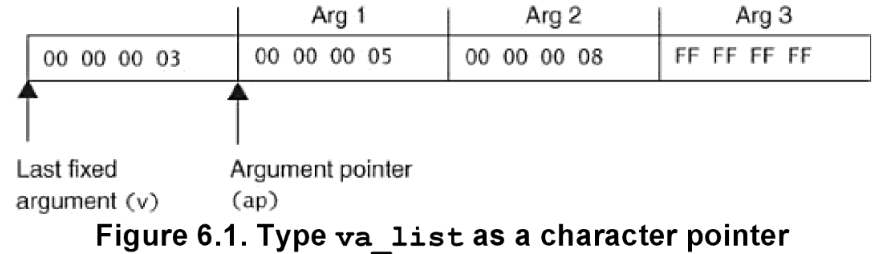

# 실전코딩 기말 프로젝트
## 이주홍
### 202021223

* unsigned, Floating 18bit, Integer 14
* **multiplication의 fx_mul_o 함수와 division의 fx_div_reciprocal 함수를 집중적으로 봐주셨으면 좋겠습니다. 많은 노력이 들어간 함수입니다.**

## 1. Fixed point
fixed point는 고정소수점이라는 의미로, 컴퓨터에서 실수를 표현할 때 Integer bit와 Floating bit를 고정하여 정하여 실수를 표현하는 방식이다.

이번 project에서는 Integer bit를 14bit, Floating bit를 18bit로 할당한 unsigned 32bit 수를 표현하고자 하였다.

$[00000000000000].[000000000000000000]$

**상위 14bit는 Integer bit**, **하위 18bit는 Floating bit**

위와 같은 형식을 따를 때 표현가능한 최댓값과 최솟값을 유추할 수 있다.

최댓값 : $[11111111111111].[111111111111111111]$ : 32767.6185

최솟값 : $[00000000000000].[000000000000000001]$ : 0.3815

**이번 project에서는 unsigned 연산이므로 fixed point를 계산하기 위해 unsigned int형을 fixed형으로 정의하여 사용한다.**

## 2. Calculation Algorithm
## 0) toFloat,fromFloat

### 1. fromFloat

함수 정의 : float형을 fixed 형으로 변환하는 함수

함수 설명 : float형에의 변수에는 직접적으로 bit shift를 할 수 없다. 그러므로 1을 18만큼 left bitshift를 하여 곱함으로 bit shift를 한 것과 같은 결과를 유도한다.

이 과정을 통해 32bit computer에서 원래 float형의 하위 integer 14bit와 상위 float 18bit로 구성된 새로운 fixed형 변수를 얻을 수 있다.

함수 코드

        fixed fromFloat(float f)
        {
        fixed ret;

        ret = (fixed) (f*(1<<FX_Q_NUM));
        return ret;
        }

### 2. **toFloat**

함수 정의 : fixed형을 float 형으로 변환하는 함수

함수 설명 : fixed x를 $2^{18}.0f$로 나눔으로써 강제로 float형으로 변환시키는 함수

함수코드

    float toFloat(fixed x)
    { 
        return (x/FX_Q_FVAL);
    }

## 1) ADD, SUBTRACT
fixed point의 add와 subtract는 매우 간단하다. 특별한 자릿수의 변환없이 덧셈과 뺄셈을 해주면 된다.

이러한 간단한 연산 속에서 본 프로젝트는 **scanf,printf에서 영감을 받아 임의의 개수의 수들를 입력받아 더하거나 빼는 ADD와 SUBTRACT를 구현**하였다.

### 1. **add**
함수 정의 : num_args 만큼의 변수를 parameter로 받아 그 합을 구하는 함수

-----
함수 설명 :

출처 : Secure Coding in C and C++(2013)

1. **va_list** ap 작동(va_list는 macro)
이 때 va_list는 pointer가 되어 parameter의 변수들이 모인 맨 처음 주소를 가리킨다.

2. num_args는 입력된 변수가 아닌 변수의 개수만을 가리키므로 num_args의 크기만큼 pointer 이동(va_start macro의 역할)

3. 현재 ap가 가리키는 주소의 값을 sum에 더하고 fixed의 크기만큼 그 주소를 이동시킴.(va_arg macro의 역할)

4. va_end(ap)로 ap가 NULL을 가리키게 함. (종료의미)
-----
함수 코드 : 

    fixed add(fixed num_args, ...)
    {
        va_list ap;
        va_start(ap,num_args);
        fixed sum = 0;

        for(int i = 0;i<num_args;i++)
        {
            sum += va_arg(ap,fixed);
        }
        va_end(ap);

        return sum;
    }

### 2. **subtract**

Without Lose Of Generality

add의 +를 -로 대체

## 2) multiplication

### fx_mul_o
**Precision과 Speed를 동시에 만족하는 함수**

함수 정의 : Integer와 Floating point를 나누어 계산하는 multiplication 함수

함수 설명 : 곱하기연산이 underflow와 overflow에 취약한 점을 개선하고자 고안된 multiplication 함수이며 bitshift와 곱하기 연산만을 사용하므로 충분한 속도를 보장받는다.

#### 1. Integer와 Floating 분리
a와 b를 입력받았을 때

a>>18 연산을 할 경우 a의 Integer part만 남음.
b>>18 연산도 마찬가지

(a<<14)>>14 연산을 할 경우 a의 Floating part만 남음.
(b<<14)>>14 연산도 마찬가지

#### 2. Integer와 Floating의 연산

간단한 인수분해 공식을 떠올려보자.
현재 a라는 수를 a_I와 a_F라는 정수와 소수로 나눈 상태이다.

즉, a = a_I+a_F.

b도 마찬가지로

b = b_I+b_F라고 할 수 있다.

이 때 **ab = (a_I + a_F)(b_I + b_F) = a_I$\times$b_I + a_F$\times$b_I + a_I$\times$b_F + a_F$\times$b_F** 로 쓸 수 있다.

1. a_I$\times$b_I : 두 Integer를 곱하는 연산을 그냥 해주게 되면 현재 우측으로 18bit 이동한 상태이기 때문에 다시 좌측으로 18bit 이동해주어야 한다. 
즉 (a_I$\times$b_I)<<18로 구현 된다.

**위와 같이 Integer part를 우측 끝까지 bit shift를 해줌으로 overflow를 최대한 방지한채로 연산이 가능하다.**

2. a_F$\times$b_I + a_I$\times$b_F : Integer들은 우측 끝까지 bit shift 되어 있으나 a_F와 b_F는 $2^{18}$이 곱해진 것과 같으므로 그냥 그대로 a_F$\times$b_I + a_I$\times$b_F 와 같이 구현하면 된다.

3. **a_F$\times$b_F**
가장 문제가 되는 부분이다. 그냥 연산을 하게 되면 연산의 정확도가 매우 떨어지게 된다. 

왜냐하면 a_F와 b_F는 각각 18개의 bit로 표현되어 있기 때문이다. a_F와 b_F를 fixed의 float부분이 아닌 그냥 unsigned integer로 간주한다면 a_F,b_F<=$2^{18}-1$이다. 이 때 두 수를 곱하면 a_F$\times$b_F <= $2^{36}-1$ 부등식이 성립함을 알 수 있고 즉 36bit가 필요하다는 결론을 얻는다.(overflow)

이를 어떻게 해결할 수 있을까? 답은 간단하다. a_F와 b_F를 2bit씩 left bit shift한 후 곱하면 된다.
a_F>>2, b_F>>2를 한다면 a_F>>2$\times$b_F>>2 <= $2^{32}-1$로 32bit만 가지고 곱을 표현할 수 있다.

32bit로 두 Floating의 곱을 표현했다면 우측으로 14bit(Integer bit)만큼 bit shift하여 더해주면 된다. 

구현은 다음과 같다.

**(((p_a>>2)*(p_b>>2))>>14)**

이와 같은 방식을 통해 곱셈을 구현한다면 소수의 곱셈에서 매우 정확한 값을 얻을 수 있다.

**약간의 bitshift 연산을 더해주면 위에서 2bit씩을 포기한 정확도도 챙길 수 있다. 그러나 계산이 충분히 정확하고 연산 시간을 위해 이는 본 프로젝트에 구현하지 않았다.**
#### 3.함수 코드

        fixed fx_mul_o(fixed a, fixed b)
        {
        fixed I_a = a>>FX_Q_NUM;
        fixed I_b = b>>FX_Q_NUM;
        fixed p_a = (a<<FX_I_NUM)>>FX_I_NUM;
        fixed p_b = (b<<FX_I_NUM)>>FX_I_NUM;

        return (((I_a*I_b)<<FX_Q_NUM)+I_a*p_b+I_b*p_a+(((p_a>>2)*(p_b>>2))>>FX_I_NUM));
        }

#### 4. 예시
1.5 $\times$ 2.5 = 1.1 $\times$ 10.1

위 식을 다음과 같이 분해한다.

1(1>>18) * 10(2>>18) + 1(1>>18) * 100000000000000000(0.5) +
100000000000000000(0.5) * 10(2>>18) +
1000000000000000(0.5>>2) * 1000000000000000(0.5>>2)

### fx_mul_64

함수 정의 : 변수들을 long long type으로 casting하여 곱을 연산하는 함수

함수 설명 : 상동

함수 코드 :
        fixed fx_mul_64(fixed a, fixed b)
        {
            return ((long long) a * (long long) b) >> FX_Q_NUM;
        }

### fx_mul_with_Integer

함수 정의 : divisor가 integer일 때 나누는 함수

함수 설명 : divisior가 integer라면 최소 19bit이상에 1bit가 위치해있고 18bit shift를 미리 b에 적용하더라도 underflow가 발생하지 않는다. 이러한 특성을 활용하여 1번의 bit shift와 1번의 multiply를 통해 구현하였다.

함수 코드 :
        fixed fx_mul_with_integer(fixed a, fixed b)
        {
            return a * (b >> FX_Q_NUM);
        }

### fx_mul_f

함수 정의 : dividend를 부동소숫점으로 변환한 후에 divisor로 나누는 함수

함수 설명 : dividend를 부동소숫점으로 변환하므로 매우 큰 범위를 표현할 수 있게 되었고 높은 정확도를 보이나 고정소숫점 내에서 연산을 구현하고자 하는 우리의 취지와 부합하지 않는 함수이다.

함수 코드 :
        fixed fromFloat(float f)
        {
            fixed ret;

            ret = (fixed) (f*(1<<FX_Q_NUM));
            return ret;
        }

## 3. Division

### fx_div_reciprocal

함수 정의 : divisor의 역수(reciprocal)을 구하여 곱하는 함수

함수 설명 : division 과정 중 overflow와 값이 손실나는 상황을 해결하기 위해 고려된 함수. 

division과정 중 $2^{18}$을 곱해줄 필요가 있기 때문에 이를 역수를 구하는 과정에서 미리 연산을 해줌으로 overflow를 회피.

정수의 나눗셈에서 dividend 이하의 값들이 손실되는데 이를 방지하고자 역수를 구해 연산하고자 함.

#### 역수 구하기
32bit에서 int가 표현가능한 수의 범위는 최대 $2^{31}-1$까지이다. 이때 1을 최대로 왼쪽으로 bitshift할 경우 01111111111111111111111111111111로 표현 할 수 있고 이는 2147483647이다.

2147483648을 쓰지 않고 2147483647을 쓰는 이유는 2147483648부터는 long type이 되기 때문이다.

fixed type에서 1.0은 1000000000000000000이고 이를 13bitshift하면 2147483648(1000000000000000000000000000000000000000)이고 int type으로 연산하기 위해 2147483647(01111111111111111111111111111111)을 사용한다.

1을 왼쪽으로 13번 bitshift 한 후 dividend로 나누어주고 다시 5bit를 왼쪽으로 bitshift하면 overflow를 방지하면서 dividend의 역수에 $2^{18}$을 곱한 수를 구할 수 있다.

이를 divisor와 곱해주면 division 값을 구할 수 있다. 곱하는 과정은 fx_mul_o함수를 활용한다.

함수 코드

        fixed fx_div_reciprocal(fixed a, fixed b)
        {
            if(b==0) return 0;

            fixed reciprocal = ((fixed) ((2147483647)/b)<<5);

            return fx_mul_o(a,reciprocal); 
        }

### fx_div_f

함수 정의 : divisor와 dividend를 float로 type casting하여 나눗셈을 연산

함수 설명 : float로 type casting하여 연산하므로 매우 정확한 연산이지만 fixed point로 연산하고자 하는 우리의 취지와 맞지 않는 연산이며 arm9 processor에서는 나눗셈기의 부재로 더 오랜 시간이 걸리는 연산이다.

함수 코드 :

        fixed fx_div_f(fixed a,fixed b)
        {

            return b==0 ?0 : (fixed) (FX_Q_FVAL * (float)a / (float) b);
        }

### fx_div_64

함수 정의 : dividend를 long long type으로 casting함으로 구현된 division 연산 함수

함수 설명 : dividend를 long long type으로 casting 하고 $2^{18}$을 곱함으로 overflow를 피하고 이후 divisor로 나누어 연산하는 함수이다.

함수 코드 : 

        fixed fx_div_64(fixed a, fixed b)
        {
            return  b==0 ? 0 :(fixed)(((long long)a<<FX_Q_NUM)/b);
        }

### fx_div

함수 정의 : 가장 naive approach를 적용한 division 함수

함수 설명 : dividend를 divisor로 나눈 후 $2^{18}$을 곱해줌으로 division을 구현

함수 코드 :

        fixed fx_div(fixed a,fixed b)
        {
            return b==0 ? 0 :((fixed)(a/b))>>FX_Q_NUM;
        }

